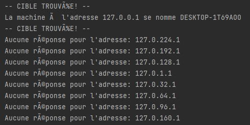

# Utilisation de Raw Socket et vulnérabilité d’un réseau - Lab #4
## Participants

* Simon Duchesne - DUCS20069507
* Alexandre Bourdarie - BOUA28070007

## Guide d'utilisation

### Commandes

Veuillez lancer le programme en utilisant la ligne de commande suivant ou se trouve l'exécutable:
./FindHost {Hostname} {FirstPrefixNumber} {SecondPrefixNumber}

### Variables
* {Hostname}: Nom de l'hôte recherché. (ex: P2-1023-pr)
* {FirstPrefixNumber}: Premier nombre de l'adresse ip.(ex:127)
* {SecondPrefixNumber}: Deuxième nombre de l'adresse ip. (ex:0)

Les éléments fournis dans l'exemple ci-dessus fera en sorte que le programme cherchera l'appareil qui se nomme P2-1023-pr
dans la plage d'adresse ip allant de 127.0.0.0 à 127.0.255.255

Lorsque le logiciel aura fait toutes les adresse, un fichier texte *Result.txt* sera créé et contiendra tous les noms de 
machines trouvées.
## Stratégie employé

8 Threads se séparent la plage d'adresse ip à analyser.

## Capture
Résultat sur un ordinateur personnel pour l'adresse local (127.0.x.x)

